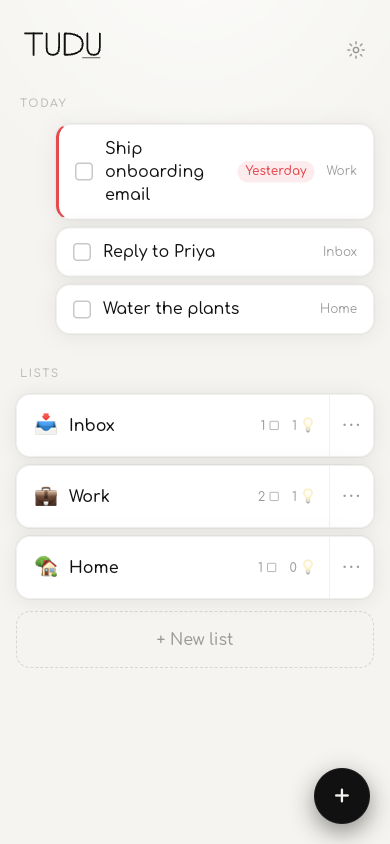

# TUDU

Capture **tasks** and **ideas** into **lists**. A tiny local-first PWA — no account, no server, your data never leaves your device.

<p align="center"></p>

**Use it:** https://altrintitus.github.io/TUDU/

## Install on iPhone

1. Open the link above in **Safari**.
2. Tap **Share** → **Add to Home Screen**.
3. Open TUDU from your home screen — it runs full-screen and works **offline** from then on.

*(Android/desktop: Chrome offers "Install app" in the address bar.)*

## What it does

- Lists hold both **tasks** (checkbox + optional due date) and **ideas** (free-form notes; first line = title).
- **Today** view collects due + overdue tasks across every list.
- ~3-second capture sheet with smart defaults (remembers last type + list).
- Full-screen autosaving idea editor.
- JSON **export / import** backup (Settings) — replace-all with confirm.
- Offline-first, installable; warm monochrome design, light + dark follow your system.

## What it deliberately doesn't do

Notifications, sync, accounts, tags, repeats, subtasks, search — see [`SPEC.md`](SPEC.md) for the closed v1 scope.

## Local development

```bash
npm install
npm run dev        # dev server
npm run verify     # typecheck + lint + unit (vitest) + e2e (playwright)
```

**Stack:** Vite · React · TypeScript · Dexie (IndexedDB) · vite-plugin-pwa · hash routing. Deployed to GitHub Pages by [`.github/workflows/deploy.yml`](.github/workflows/deploy.yml) on every push to `main`.

## Privacy

Everything is stored in your browser's IndexedDB on your device. No servers, no accounts, no telemetry. Back up any time via **Settings → Export**.

## License

[MIT](LICENSE) © Altrin Titus
