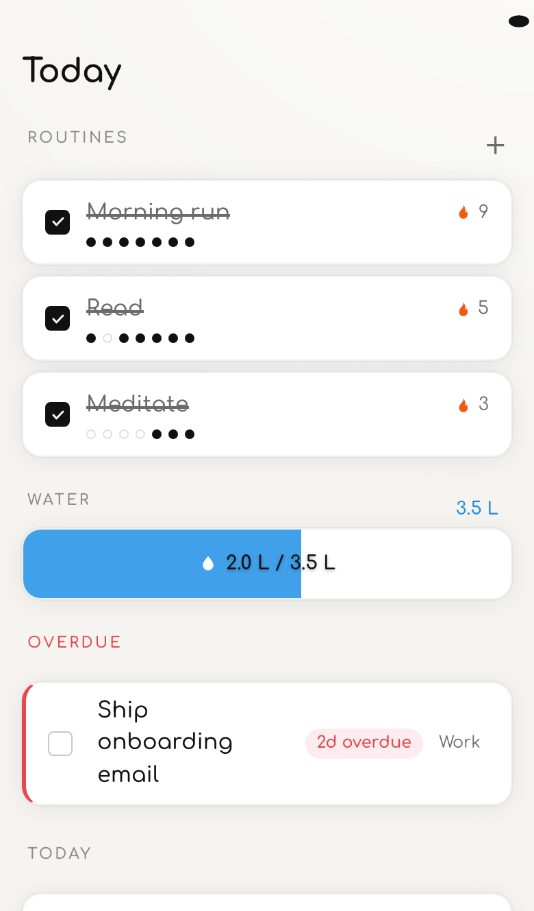
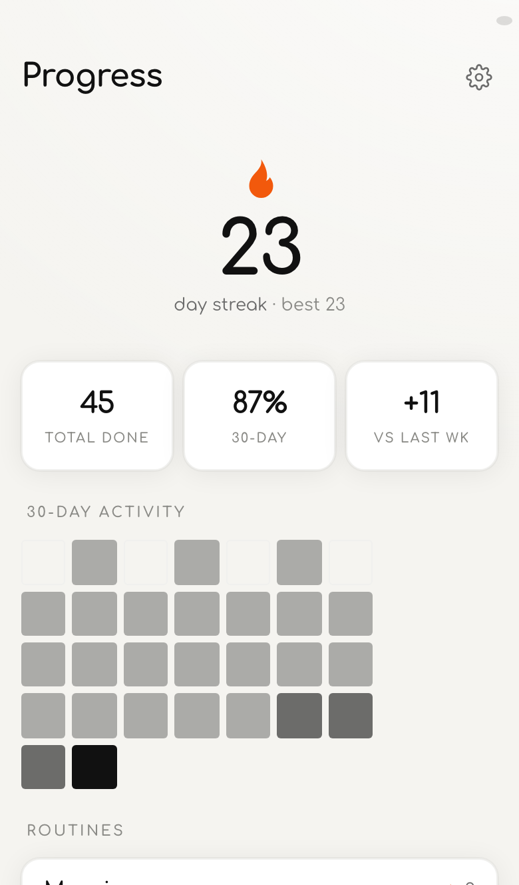

# TUDU

Capture **tasks** and **notes**, build **routines**, track your day. A tiny local-first PWA — no account, no server, your data never leaves your phone.

<p align="center">
  
  &nbsp;&nbsp;
  
</p>

**Try it → https://altrintitus.github.io/TUDU/**

## Install on iPhone

1. Open the link in **Safari**.
2. **Share → Add to Home Screen**.
3. Launch it from your home screen — full-screen, and works **offline** from then on.

*(Android/desktop: Chrome shows "Install app" in the address bar.)*

## Three swipeable pages

- **Today** — check off your **routines** (each with a streak counter + 7-day history), drag the **water meter** toward your daily goal, and clear tasks grouped Overdue / Today / Upcoming.
- **Spaces** — organise **tasks** (checkbox + due date) and **notes** (free-form text) into your own spaces.
- **Progress** — current streak, a 30-day activity heatmap, and consistency stats across everything you do.

Plus ~3-second capture from the **＋** button, JSON export/import backup, and a warm light/dark theme that follows your system.

## Not included (by design)

Notifications, sync, accounts, tags, repeats, subtasks, search — see [`SPEC.md`](SPEC.md) for the closed v1 scope.

## Local development

```bash
npm install
npm run dev       # dev server
npm run verify    # typecheck · lint · vitest · playwright
```

**Stack:** Vite · React · TypeScript · Dexie (IndexedDB) · vite-plugin-pwa · hash routing. Auto-deployed to GitHub Pages on every push to `main`.

## Privacy

Everything lives in your browser's IndexedDB, on your device. No servers, no accounts, no telemetry. Back up anytime via **Settings → Export**.

## License

[MIT](LICENSE) © Altrin Titus
